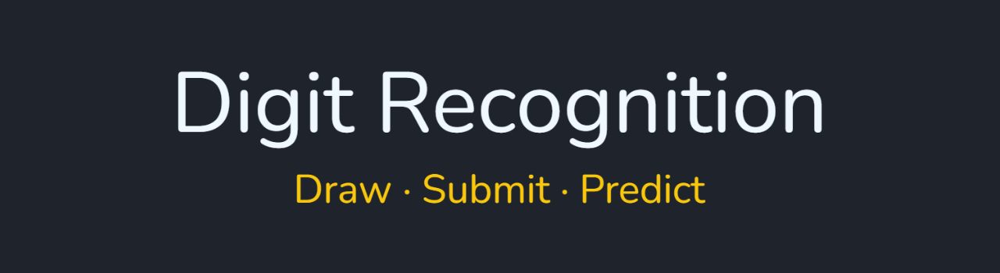
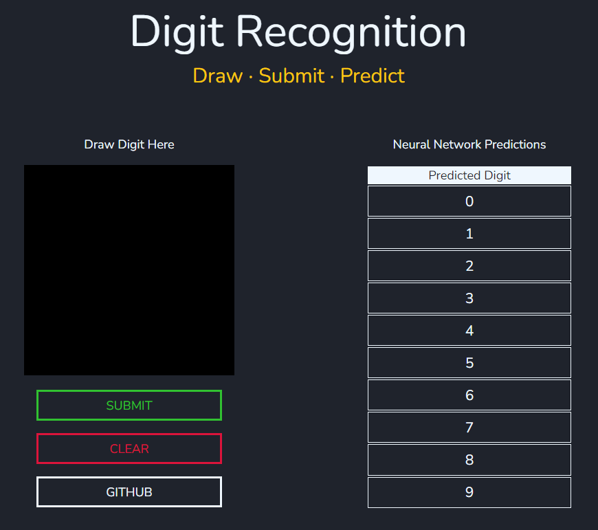

   

# Digit Recognition Web Application (WIP)
React.js (frontend) and Flask (backend) web application that incorporates a neural network to identify user-drawn digits.

I am incorporating the neural network model from my [MNIST Neural Network](https://github.com/rahulio96/MNIST-Neural-Network) project for identification as a part of the Flask backend.

## Description

- The user draws the digit and hits submit, which sends the image's URL to the Flask backend using a POST request
- The Flask server then preprocesses the image and converts it into a tensor
- Afterward, the tensor is given to the neural network model for identification, which results in a predicted digit
- The digit is then sent back to the React.js frontend where it will be displayed on the table

## Demo

